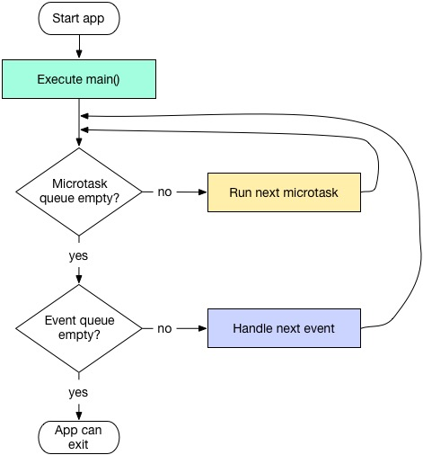

### Dart 是单线程语言

首先，要记住的第一点，Dart 是单线程。

在 Flutter 中，和线程相关的有 Future、async、await、Isolate。它们的联系和区别是什么？

首先，Isolate 类似于 Java 中的线程，我们在 Flutter 中写的代码默认都运行在 Main Isolate （主线程）中。

和安卓类似，Main Isolate 有一个事件循环，UI 动画的响应，还有一些业务逻辑，都是在这个事件循环中执行。

因为 Isolate 是单线程，所以 Isolate 中的代码都是按顺序执行的。但是即使是按顺序执行，也有个优先级。

优先级可以分为 3 个级别：

1. Main 代码块，我们写的代码一般都是在 Main 代码块中
2. Microtask 任务，Flutter 在执行完 Main 代码块的任务之后，就会检查 Microtask Queue 中有没有任务需要执行。我们一般用 schedultMicrotask 方法来向 Microtask Queue 中添加任务。
3. Event Queue 任务，这个是我们平常用的比较多的，当我们使用 Future 或 async/await 的时候，相应的任务就会被加入到 Event Queue 中。

执行顺序：

Main > Microtask > EventQueue

如图：



可以看到，Flutter 中的代码执行顺序是：

1. 执行 Main 代码中的任务
2. 执行完 Main 代码中的任务之后，检查 Microtask Queue 中有没有任务，有的话就执行
3. 如果 Microtask Queue 中没有任务，再检查 Event Queue 中有没有任务，有的话就执行

### Future

从功能上来讲，Future 和 async/await 的功能是相似的，都是向 Event Queue 中插入 event 来实现异步操作。但是 Future 有一个优点。那就是***链式调用***：

```dart
new Future(() => print('任务1'))
    .then((i) => print('任务2'))
    .then((i) => print('任务3'))
    .whenComplete(() => print('任务完成'));
```

输出：

```dart
任务1
任务2
任务3
任务完成
```

链式调用，可以让代码更加清晰。

上面的代码中，我们使用了 `then`，Future 中的 then 方法返回的虽然也是 Future，但是它并没有创建新的 Event 丢到 Event Queue 中，而是一个普通的 Function，在一个 Future 所有的 Futction 执行完后，下一个 Future 才会执行。

多个 Future 的执行顺序：

1. 先创建的 Future 先执行
2. 如果 Future 使用 then 进行链式调用，需要等到这个 Future 的 then 执行完，下一个 Future 才能执行
3. 如果对一个已经执行完的 Future 添加 then，那么 then 中的任务会被丢到 MicroTask Queue。

实验：

```dart
Future f1 = new Future(() => print('f1'));
Future f2 = new Future(() => null);
Future f3 = new Future.delayed(Duration(seconds: 1), () => print('f3 f2'));
Future f4 = new Future(() => null);
Future f5 = new Future(() => null);

f5.then((_) => print('f5.then f4'));
f4.then((_) {
  print('f4.then f4');
  new Future(() => print('f4.then f5'));
  f2.then((_) {
    print('f4.then f2.then f6');
  });
});
f2.then((m) {
  print('f2.then f7');
});
print('main f8');
```

打印：

```
main f8
f1
f2.then f7
f4.then f4
f4.then f2.then f6
f5.then f4
f4.then f5
f3 f2
```

#### 解析：

Main 代码块中的任务，最先执行，打印：

> main f8

Future 任务的执行顺序和创建顺序一致

f1 先创建，所以先执行，打印
> f1

接着是 f2，f2 的任务是空，
接着执行 f2.then，打印：

> f2.then f7

接着是 f3，但是 f3 的任务是延迟 1 秒打印

接着是 f4，f4 的任务是空，

接着是 f4.then，打印：

> f4.then f4

新建的 Future 将在 Event Queue 尾部，最后被执行，所以接着执行 f2.then，此时 f2 已经执行完了，所以 f2.then 任务会被放入 MicroTask Queue 中，而 MicroTask 任务的优先级比 Event Queue 高，所以先执行 f2.then，打印：

> f4.then f2.then f6

接着执行 f5，f5 任务是空，

接着是 f5.then，打印：

> f5.then f4

到这里，所有第一次创建的 Future 就执行完了，

接着执行二次创建的 Future，也就是 f4.then 中创建的 Future，打印：

> f4.then f5

1 秒之后，执行 f3，打印：

> f3 f2